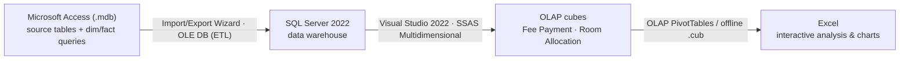
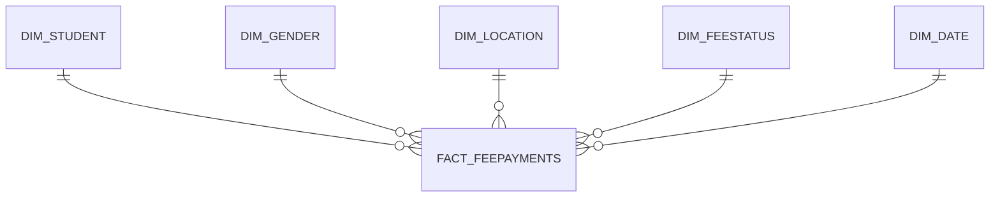

# Hostel Management — Business Intelligence (SQL Server + SSAS OLAP Cubes)

An end-to-end Business Intelligence / data-warehousing project that turns scattered,
transactional hostel data into analysis-ready **OLAP cubes**. Two star-schema data
marts — **Fee Payment** and **Room Allocation & Occupancy** — were modeled, loaded
through an Access → SQL Server → SSAS pipeline, and made explorable in Excel via OLAP
PivotTables.

Built as the individual project for **Knowledge Management & Business Intelligence**
(M.S. Data Analytics for Business, Seattle Pacific University).

## Pipeline / architecture

The data was first shaped into dimension and fact **queries** in Access, exported to a
new SQL Server data warehouse, then modeled in an SSAS Multidimensional project (data
source + data source view, logical keys, fact-to-dimension relationships) and deployed
as processed cubes. Excel connected over OLAP to slice, dice, and drill the results.

## Data marts

### Cube 1 — Fee Payment
**Fact:** `Fact_FeePayments` (grain: one fee transaction)
**Measures:** total payment amount, average payment, count of payments
**Dimensions:** `Dim_Student`, `Dim_Gender`, `Dim_Location`, `Dim_FeeStatus`, `Dim_Date`

### Cube 2 — Room Allocation & Occupancy
**Fact:** `Fact_RoomAllocations` (grain: one room allotment)
**Measures:** room allocation count, capacity used, vacancy rate
**Dimensions:** `Dim_Student_Room`, `Dim_Gender`, `Dim_Location`, `Dim_Room`,
`Dim_RoomStatus`, `Dim_DateRoomAllot`

A dedicated date dimension was built in Excel and imported so time analysis stayed clean
and avoided cartesian/cross-join blow-ups against sparse transaction dates.

## Hierarchies (drill-down)
- **Date:** Year → Quarter → Month → Day
- **Location:** Country → State → City
- **Student:** First Name → Last Name → Age

## Insights delivered
- Which students have **unpaid / overdue fees**, and overall collection totals.
- **Monthly fee-collection trends** and **regional** payment patterns.
- **Room occupancy** and **vacancy** by gender, location, room type, and time.
- Capacity utilization to spot under-used rooms and plan for peak demand.

## Tech stack
Microsoft Access · SQL Server 2022 · SQL Server Analysis Services (SSAS,
Multidimensional) · Visual Studio 2022 · Excel (OLAP PivotTables, offline `.cub`) ·
star-schema dimensional modeling · OLAP hierarchies.

## Skills demonstrated
Dimensional modeling (star schema, fact/dimension design) · OLAP cube design &
deployment · ETL (Access → SQL Server) · data warehousing · OLAP hierarchies &
measures · referential integrity · BI reporting and visualization.

## Limitations & lessons learned
- **Data-type mapping** between Access and SSAS caused cube-processing errors until
  fields (dates, IDs) were cleaned and cast consistently — a reminder to lock types early.
- **Missing data:** students with no payment had no fact row, so non-payers were hard to
  surface. Fix: stage a default "Not Paid" status (or outer-join during staging) so absence
  is represented in the cube.
- **Cartesian joins** appeared until primary/foreign keys and referential integrity were
  enforced on the room dimension.
- **Manual ETL** was repeated on every schema change; next iteration would automate it
  with SSIS or reusable SQL scripts, and extend to Power BI dashboards.

## Files in this repo
- `*.accdb` — Access database with source tables and dimension/fact queries.
- `Address.xlsx`, `AllotmentDate.xlsx` — Excel-built dimension sources (location, date).
- `*.xlsx` — Excel workbook with OLAP PivotTables, report sheets, and charts.
- Project report (`.pdf` / `.docx` / `.pptx`) — full design and walkthrough.
